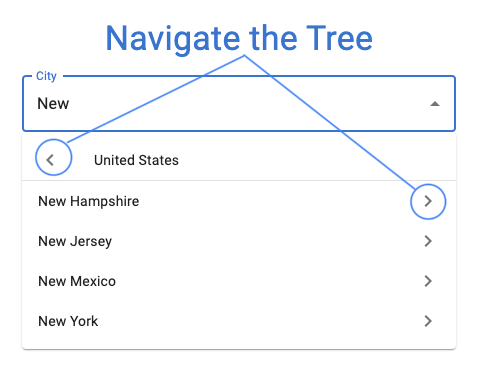

# MUI Tree Select

## Description

A select component for tree data structures that provides a compact user interface for navigating a tree.

<!-- REPLACE [<iframe src="https://codesandbox.io/embed/github/mikepricedev/mui-tree-select/tree/main/example?autoresize=1&fontsize=14&hidenavigation=1&theme=dark&view=preview"
     style="width:100%; height:500px; border:0; border-radius: 4px; overflow:hidden;"
     title="MUI Tree Select Example"
     allow="accelerometer; ambient-light-sensor; camera; encrypted-media; geolocation; gyroscope; hid; microphone; midi; payment; usb; vr; xr-spatial-tracking"
     sandbox="allow-forms allow-modals allow-popups allow-presentation allow-same-origin allow-scripts"
   ></iframe>]  -->




<!-- END -->

## Usage

<!-- REPLACE[ ] -->

[Live example here](https://codesandbox.io/embed/github/mikepricedev/mui-tree-select/tree/main/example?autoresize=1&fontsize=14&hidenavigation=1&theme=dark&view=preview).

### Basic Requirements

<!-- END -->

Given the following tree node interface.

```
class Node {
  constructor(value, parent = null, children = null) {
    this.value = value;
    this.parent = parent;
    this.children = children;
  }
}
```

1. Implement a [`getChildren`](https://mikepricedev.github.io/mui-tree-select/interfaces/TreeSelectProps.html#getChildren) method to tell Tree Select how to retrieve child nodes.

```
const rootNodes = [...] // Array of Nodes;
const getChildren = (node) => node === null ? rootNodes : node.children;
```

2. Implement a [`getParent`](https://mikepricedev.github.io/mui-tree-select/interfaces/TreeSelectProps.html#getParent) to tell Tree Select how to retrieve parent nodes.

```
const getParent = (node) => node.parent;
```

3. Implement a [`renderInput`](https://mikepricedev.github.io/mui-tree-select/interfaces/TreeSelectProps.html#renderInput) method required by [Autocomplete](https://mui.com/material-ui/api/autocomplete/#props).

```
const renderInput = (params) => <TextField {...params} />;
```

4. Pass to the MUI Tree Select.

```
return <TreeSelect
  getChildren={getChildren}
  getParent={getParent}
  renderInput={renderInput}
/>;
```

Full documentation can be found [here](https://mikepricedev.github.io/mui-tree-select/modules.html).

## Notes

### Autocomplete

This package wraps the [MUI Autocomplete](https://material-ui.com/components/autocomplete/) component. Many of props from this component are passed from `TreeSelect`.

### FreeSoloNode

[`freeSolo`](https://mui.com/material-ui/react-autocomplete/#free-solo) values are wrapped in the class [FreeSoloNode](https://mikepricedev.github.io/mui-tree-select/classes/FreeSoloNode.html) to provided a reference to the [parent](https://mikepricedev.github.io/classes/FreeSoloNode.html#parent) node under which the free solo value was created.

`FreeSoloNode` extends the native [String](https://developer.mozilla.org/en-US/docs/Web/JavaScript/Reference/Global_Objects/String) object. This **disallows** `"es5"` as a [target](https://www.typescriptlang.org/tsconfig#target) based on the way the typescript transpiler converts `class` semantics to `function`.
