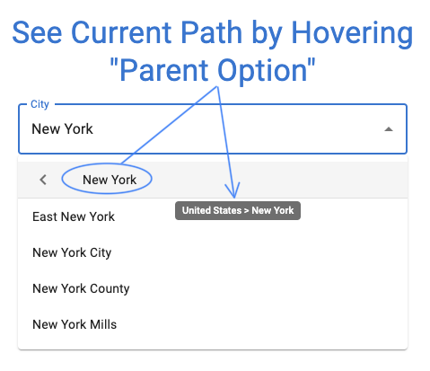
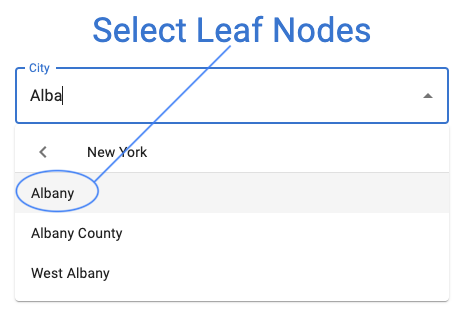

# MUI Tree Select

## Description

A select component for tree data structures that provides a compact user interface for navigating a tree.






## Usage

Check out a live example [here](https://codesandbox.io/s/lucid-chaplygin-smyzk).

### Basic Requirements

Given the following tree node interface.

```
class Node {
  constructor(value, parent = null, children = null) {
    this.value = value;
    this.parent = parent;
    this.children = children;
  }
}
```

1. Tell MUI Tree Select how to retrieve child nodes. `getChildren` should return nullish values when it is called with a leaf node.

```
const rootNodes = [...] // Array of Nodes;
const getChildren = (node) => node === null ? rootNodes : node.children;
```

2. Tell MUI Tree Select how to retrieve parent nodes.

```
const getParent = (node) => node.parent;
```

3. Implement `renderInput` from [Autocomplete](https://mui.com/material-ui/api/autocomplete) props.

```
const renderInput = (params) => <TextField {...params} />;
```

4. Pass to the MUI Tree Select.

```
return <TreeSelect
  getChildren={getChildren}
  getParent={getParent}
  renderInput={renderInput}
/>;
```

<!-- Full Interface can be found [here](docs/interfaces/TreeSelectProps.html). -->

## Notes

### Autocomplete

This package wraps the material-ui [Autocomplete](https://material-ui.com/components/autocomplete/). Many of props from this component are passed from `TreeSelect`.

### FreeSoloNode

[`freeSolo`](https://mui.com/material-ui/react-autocomplete/#free-solo) values are wrapped in the class [FreeSoloNode](docs/classes/FreeSoloNode.md) to provided a reference to the [parent](FreeSoloNode.md#parent) node under which the free solo value was created.

`FreeSoloNode` extends the native [String](https://developer.mozilla.org/en-US/docs/Web/JavaScript/Reference/Global_Objects/String) object. This **disallows** `"es5"` as a [target](https://www.typescriptlang.org/tsconfig#target) based on the way the typescript transpiler converts `class` semantics to `function`.
